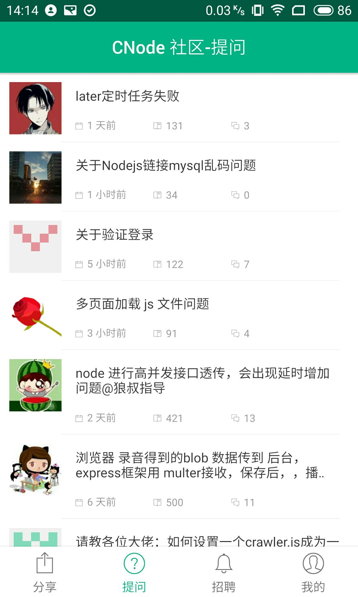
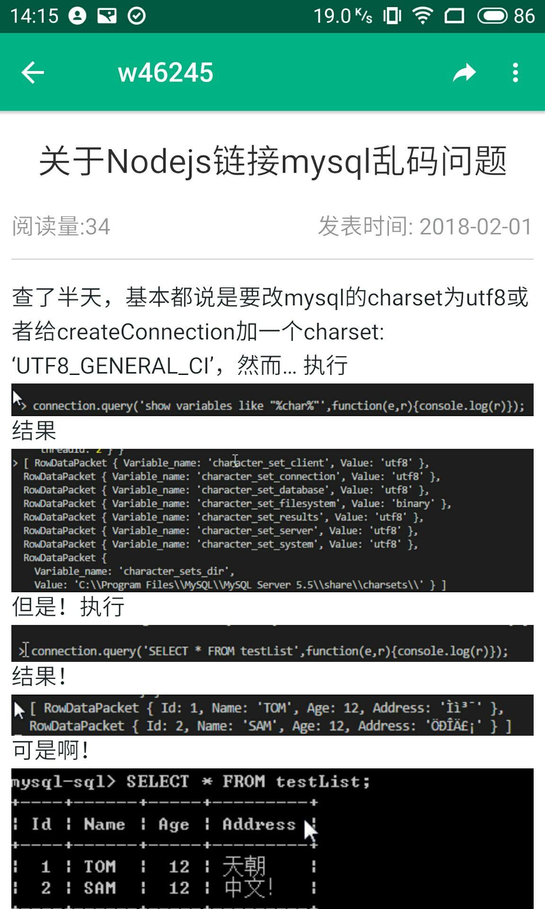
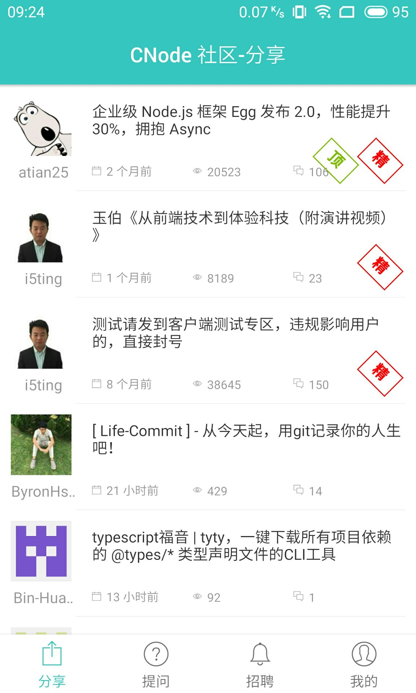
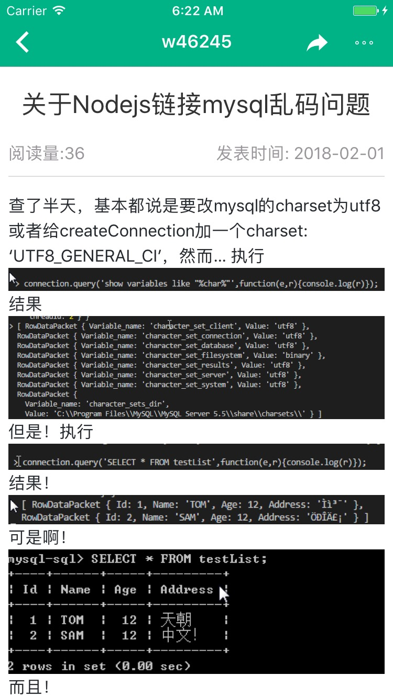
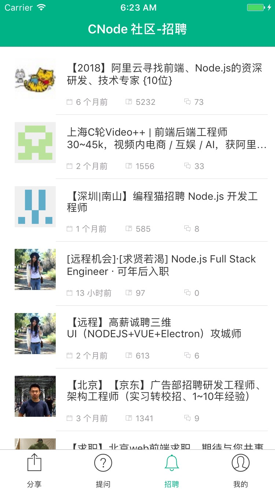
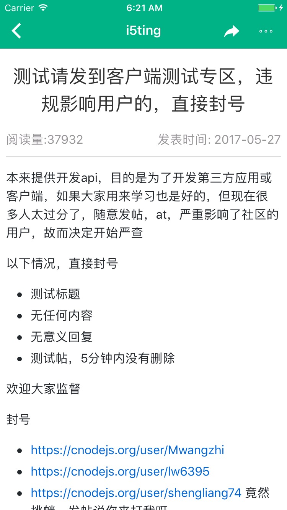

# CNode

由React Native 开发的移动APP,数据接口由 `http://cnodejs.org/` 提供
## 使用教程

1. 下载项目
    ###### `git clone git@github.com:25juan/CNode.git`
1. 执行 yarn 命令安装项目运行所需要的包 
    ###### `yarn`
1. 运行程序
    ###### `react-native run-ios ` or `react-native run-android`
## 功能列表
1. APP启动页(待完成)
1. 主题列表展示(待完成)
1. 主题列表详情展示(待完成)
1. 主题分享、转发功能(待完成)
1. 主题收藏(待完成)
1. 个人登录(待完成)
1. 个人资料查看(待完成)

1. 退出登录功能(待完成)
1. 杂项(待完成)

## 项目截图
#### Android

#### IOS

     
    