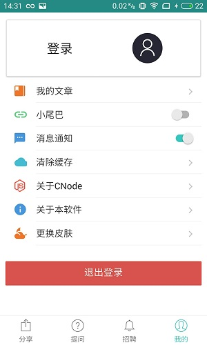

# CNode

由React Native 开发的移动APP,数据接口由 `http://cnodejs.org/` 提供
## 注意
在运行debug模式的apk可能会比较，但是在真机上运行release版本不会出现这种情况 
## 使用教程
1. 三方库列表
    1. [color  ](https://github.com/Qix-/color)
    1. [lodash ](https://github.com/lodash/lodash)
    1. [mobx ](https://github.com/mobxjs/mobx)
    1. [mobx-react](https://github.com/mobxjs/mobx-react)
    1. [moment](https://github.com/moment/moment)
    1. [native-base](https://github.com/GeekyAnts/NativeBase)
    1. [react-native-easy-toast ](https://github.com/crazycodeboy/react-native-easy-toast)
    1. [react-native-material-menu ](https://github.com/mxck/react-native-material-menu)
    1. [react-native-splash-screen ](https://github.com/crazycodeboy/react-native-splash-screen)
    1. [react-native-storage  ](https://github.com/sunnylqm/react-native-storage)
    1. [react-navigation](https://github.com/react-navigation/react-navigation)
    1. [react-native-camera](https://github.com/react-native-community/react-native-camera)
    1. [react-native-fetch-blob](https://github.com/wkh237/react-native-fetch-blob)

1. 下载项目
    ###### `git clone git@github.com:25juan/CNode.git`
1. 执行 yarn 命令安装项目运行所需要的包 
    ###### `yarn`
1. 运行程序
    ###### `react-native run-ios ` or `react-native run-android`
1. 如果想查看真实数据请将`CNode/src/store/url.js`中的 ```let dev = true``` 置为true即可
## 功能列表
1. <del>主题列表展示</del>
1. <del>主题列表详情展示</del>
1. <del>换肤功能</del>
1. <del>主题刷新在浏览器中打开</del>
1. <del>主题刷新、分享、转发功能</del>
1. <del>app 桌面图标</del>
1. <del>个人资料查看</del>
1. <del>APP启动页</del>
1. <del>个人登录</del>
1. <del>退出登录功能</del>
1. <del>文章发布</del>
1. <del>图片单击预览功能</del>
1. <del>主题收藏</del>
1. <del>杂项</del>

## 项目截图
#### Android





#### IOS


## 总结
在这一次的开发中，遇到了不少的问题，但是其中也学到了不少的东西，这里做一个记录，方便以后查阅.

#### Q&A

##### Q:为什么不用redux 而用 mobx

A:redux对于初学者来说比较复杂，学习曲线比较陡峭。mobx相对比较轻量级点，容易上手，redux含有
中间件的配置，也是比较复杂的。如果把redux比作拖拉机的话，mobx就是跑车。比较适合这种小型项目。不用考虑
太多的东西，所以选择mobx。但是具体选择哪一种根据自己的业务逻辑来进行选择
##### Q:`TabNavigator` 嵌套在某组件中，某组件再加入到`StackNavigator`中，那么`TabNavigator`
的子组件可以导航到 `StackNavigator` 里面的组件吗？

A:不能。解决方法，将 `StackNavigator` 的 `navigation` 传入到 `TabNavigator` 的`screenProps`里面，
TabNavigator的子组件可以 调用 this.props.screenProps.navigate("StackNavigator配置的路由")
##### Q:mobx `componentWillReact` 第一次没有执行？

A:mobx `componentWillReact`方法在组件第一次渲染的时候是不会调用的，只有当接受到新的Props 或者
state 改变的时候才会调用。在以后的组件生命周期里面，都会执行`componentWillReact`，如果组件渲染完成
要执行代码，则可以调用React 的组件生命周期方法`componentDidMount`

##### Q:在windows 下进行Android开发的是运行`react-native run-android`的报错？

A:可以将cmd 切换到 `项目名/android` 文件夹下，执行`gradlew clean`,然后再执行`react-native run-android`

##### Q:mobx数据改变了没更新UI？

A:mobx数据是响应式的，请确保你的组件加上了 `@observer` 注解，需要的数据可以通过`@inject(需要的数据)`来
注入到组件的属性上面。

##### Q:在使用webview的时候比较慢？

A:在使用webview 的时候，可以先把数据准备好(异步)然后再打开对应画面加载webview,
这样数据回来的时候webview 已经加载了部分css和js资源了。能够提高webview 打开的速度
。但是能够用RN 解决的尽量不用webview,毕竟会影响用户体验性的。

##### Q:下载 ```gradle-wrapper.jar``` 慢 ?

A:将 ```android\gradle\wrapper\gradle-wrapper.properties``` 上面的文件通过迅雷下载下来，然后将 distributionUrl 指向本地的文件

##### Q:ios下配置启动图标和启动屏之后运行`react-native run-ios`没有生效?

A:删除项目 ```ios``` 文件夹下的build 文件夹，当通过xcode 改变了底层的代码的时候，如：app 图标，app 的启动屏应该重新build 

##### Q: 滚动渲染数据列表的时候比较卡?

A:在渲染长数据列表的时候应该尽量使用`FlatList` 组件，并且设置`initialNumToRender = {10}`属性。这样在页面加载的时候就只会渲染10条数据。在后续的滚动中会执行滚动渲染，不是把所有的数据渲染出来。

##### Q: `FlatList` 和`react-navigation`一起使用很卡?

A:在渲染数据列表的时候。不要把 `FlatList`的`onEndReachedThreshold`的值设置得太大了，设置为1即可。否则会影响整个应用的性能。

##### Q:低端机运行起来很卡?

A:在低端机中即便是正式版可能会出现运行不流畅的情况，所以就需要性能上面的优化。建议开发的时候用低端机作为开发机。(荣耀6x(卡) VS 荣耀8x(较为流畅))

##### Q:`react-native-camera`的坑

A:安装`react-native-camera`需要翻墙，如果报`Could not find com.android.support:support-v4:26.0.1 ` 请求修改
`android/build.gradle`文件
```
buildscript {
    repositories {
        jcenter()
        maven { url "https://maven.google.com/" } //添加代码
    }
    ... //其他代码
 }
 ... //其他代码
 allprojects {
     repositories {
         ... //其他代码         
         maven {
             // All of React Native (JS, Obj-C sources, Android binaries) is installed from npm
             url "$rootDir/../node_modules/react-native/android"
         }
          maven { url "https://jitpack.io" } //添加代码
          maven { url "https://maven.google.com/" } //添加代码
     }
 }
```


     
    