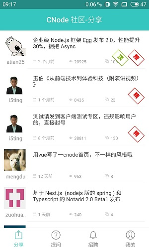
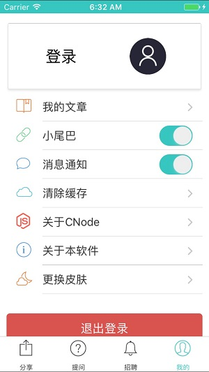
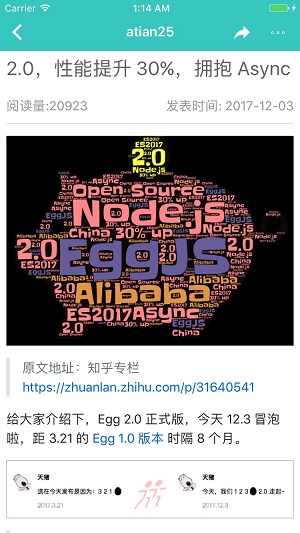

# CNode

由React Native 开发的移动APP,数据接口由 `http://cnodejs.org/` 提供
## 使用教程
1. 三方库列表
    1. color
    1. lodash
    1. mobx
    1. mobx-react
    1. moment
    1. native-base
    1. react-native-easy-toast
    1. react-native-material-menu
    1. react-navigation

1. 下载项目
    ###### `git clone git@github.com:25juan/CNode.git`
1. 执行 yarn 命令安装项目运行所需要的包 
    ###### `yarn`
1. 运行程序
    ###### `react-native run-ios ` or `react-native run-android`
1. 如果想查看真实数据请将`CNode/src/store/url.js`中的 ```let dev = true``` 置为true即可
## 功能列表
1. <del>主题列表展示</del>
1. <del>主题列表详情展示</del>
1. <del>换肤功能</del>
1. <del>主题刷新、分享、转发功能</del>
1. <del>app 桌面图标</del>
1. APP启动页(待完成)
1. 图片单击预览功能(待完成)
1. 主题收藏(待完成)
1. 个人登录(待完成)
1. 个人资料查看(待完成)
1. 退出登录功能(待完成)
1. 杂项(待完成)

## 项目截图
#### Android



#### IOS






     
    